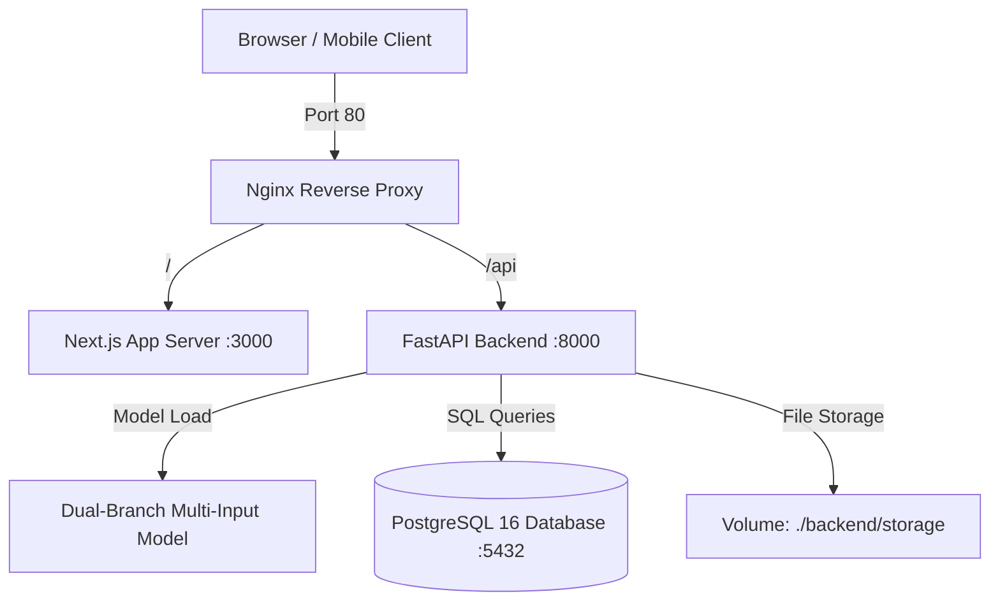

# 🚀 Textile Waste Intelligence Platform — Deployment Guide

This guide outlines the step-by-step production deployment workflow using **Docker**, **FastAPI**, **Next.js**, **PostgreSQL**, and **Nginx**.

---

## 🏗️ Architecture Overview



---

## 📋 Prerequisites

- **Docker Engine**: v24.0+
- **Docker Compose**: v2.20+
- **RAM**: 4 GB minimum (8 GB recommended for AI inference)

---

## ⚡ Quick Deployment Steps

### 1. Environment Configuration
Copy `.env.production.example` to `.env`:
```bash
cp .env.production.example .env
```

### 2. Launch Stack with Docker Compose
Run the following command to build and launch all containers in detached mode:
```bash
docker-compose up -d --build
```

### 3. Verify Container Status
Check that all 4 services are healthy:
```bash
docker-compose ps
```

Expected output:
- `textile_postgres`: Healthy (Port 5432)
- `textile_backend`: Running (Port 8000)
- `textile_frontend`: Running (Port 3000)
- `textile_nginx`: Running (Port 80)

---

## 🧪 Health Check & Endpoint Verification

| Service | Health Check Endpoint | Description |
| :--- | :--- | :--- |
| **Nginx Web** | `http://localhost/` | Next.js Executive Dashboard UI |
| **Backend API** | `http://localhost:8000/health` | FastAPI System Health JSON |
| **API Docs** | `http://localhost:8000/docs` | Swagger OpenAPI Interactive Specs |

---

## 🔒 Security & Best Practices

1. **Secret Key Rotation**: Update `SECRET_KEY` in `.env` before production deployment.
2. **Database Backups**: Periodic PostgreSQL backups can be run via:
   ```bash
   docker exec -t textile_postgres pg_dumpall -c -U textile_user > backup.sql
   ```
