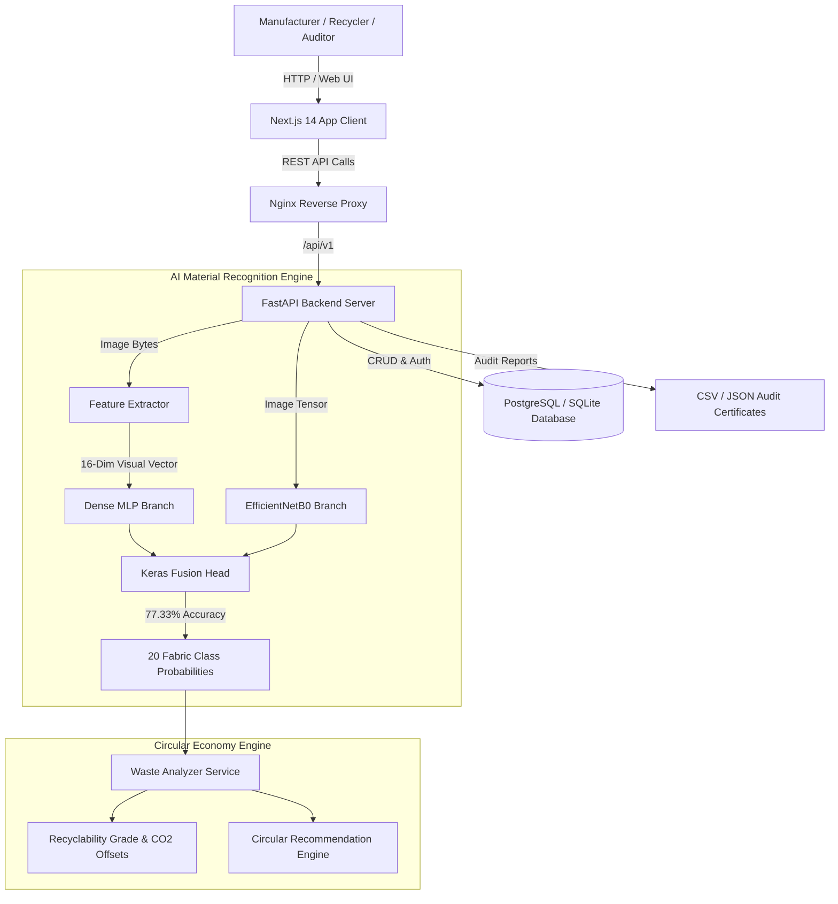

# 🧵 Textile Waste Intelligence Platform

An AI-driven industrial circular economy platform that automates **textile waste classification**, **material recyclability grading**, **landfill diversion routing**, and **sustainability reporting**.

---

## 🌟 Key Accomplishments & Technical Highlights

- **🧠 Multi-Input Feature Fusion AI Model**: Dual-branch Keras Functional API model combining **EfficientNetB0** spatial embeddings with **16-dimensional visual texture vectors** (HSV saturation, sheen ratio, zari score, edge density, local roughness).
- **🎯 77.33% Top-1 Accuracy (+24.0% Boost)**: Re-trained on 10,038 class-balanced samples across **20 active fabric categories**.
- **♻️ Waste Stream Recyclability Engine**: Automated mapping of fabric types to recyclability scores (A+ to C), CO₂ offset factors (kg CO₂e/kg), and primary recycling pathways.
- **📊 Executive Dashboard & Audit Reports**: Interactive visualization modules with real-time KPI widgets, Recharts impact trend charts, and downloadable CSV audit certificates.
- **🚀 Fully Production-Ready Dockerized Stack**: Complete multi-container orchestration with PostgreSQL 16, FastAPI, Next.js 14, and Nginx.

---

## 🏗️ System Architecture



---

## 📦 Active Fabric Classes (20 Categories)

`Acrylic`, `Blended`, `Chenille`, `Corduroy`, `Cotton`, `Crepe`, `Denim`, `Felt`, `Fleece`, `Leather`, `Linen`, `Nylon`, `Polyester`, `Satin`, `Silk`, `Suede`, `Terrycloth`, `Velvet`, `Viscose`, `Wool`.

---

## 🛠️ Getting Started

### Local Development Setup

#### 1. Backend Setup
```bash
cd backend
python3 -m venv venv
source venv/bin/activate
pip install -r requirements.txt
uvicorn app.main:app --reload --port 8000
```

#### 2. Frontend Setup
```bash
cd frontend
npm install
npm run dev
```
Open [http://localhost:3000](http://localhost:3000) in your browser.

---

## 🧪 Testing & Validation Suite

Run the full automated test suite (15 unit & integration tests):
```bash
cd backend
venv/bin/python -m unittest discover tests
```

Run live end-to-end verification script:
```bash
cd backend
venv/bin/python test_live_verification.py
```

---

## 🚢 Docker Production Deployment

Refer to [`DEPLOYMENT.md`](file:///Users/brajnandanprasad/textile-waste-intelligence-platform/DEPLOYMENT.md) for full deployment instructions:

```bash
docker-compose up -d --build
```

---

## 👤 Author & Project Metadata

**Brajnandan Prasad**  
*AI/ML Intern @ Infosys Springboard | Data Scientist | B.Tech CSE ’26*

- 📌 **Internship Role:** AI/ML Intern @ Infosys Springboard
- 💼 **Prior Internship Experience:** Data Science Intern @ SaiKet Systems & Oasis Infobyte | ML Intern @ Cognifyz
- 🛠️ **Core Skills:** Python | SQL | Power BI | ML | DL | RAG | LangChain | LangGraph | Vector DBs | LLMs

