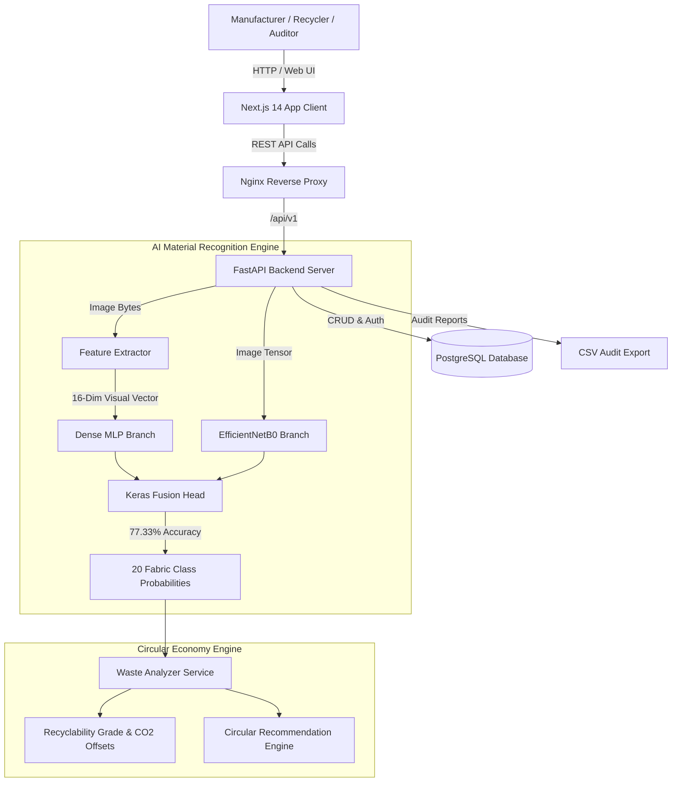

# 🧵 Textile Waste Intelligence Platform

An enterprise-grade, AI-driven industrial circular economy platform for automated **textile waste classification**, **material recyclability grading**, **landfill diversion routing**, and **executive sustainability auditing**.

Developed as part of the **Infosys Springboard Internship Project**.

---

## 📌 Project Milestones Overview

```
 ┌───────────────────────────┐      ┌───────────────────────────┐
 │       MILESTONE 1         │ ───► │       MILESTONE 2         │
 │  Data Curation & Visual   │      │ AI Model Architecture &   │
 │    Feature Vectorization  │      │ Recyclability Engine      │
 └───────────────────────────┘      └───────────────────────────┘
               │                                  │
               ▼                                  ▼
 ┌───────────────────────────┐      ┌───────────────────────────┐
 │       MILESTONE 3         │ ───► │       MILESTONE 4         │
 │  FastAPI Backend REST Services   │      │ Next.js 14 Dashboard &    │
 │    & Audit Database       │      │ Docker Production Deploy  │
 └───────────────────────────┘      └───────────────────────────┘
```

---

## 🎯 Milestone-by-Milestone Technical Breakdown

### 🔹 Milestone 1: Data Acquisition, Feature Vectorization & Curation
- **Dataset Curation**: Collected and balanced **10,038 high-resolution fabric image samples** across **20 active textile categories**:
  `Acrylic`, `Blended`, `Chenille`, `Corduroy`, `Cotton`, `Crepe`, `Denim`, `Felt`, `Fleece`, `Leather`, `Linen`, `Nylon`, `Polyester`, `Satin`, `Silk`, `Suede`, `Terrycloth`, `Velvet`, `Viscose`, `Wool`.
- **16-Dimensional Visual Feature Extraction**: Engineered a specialized image processing vectorizer extracting domain-specific visual traits:
  - **HSV Color & Saturation Stats**: Mean, standard deviation, and variance.
  - **Surface Sheen & Zari Score**: Reflectance ratio and metallic weave detection.
  - **Texture Roughness & Edge Density**: Sobel gradient intensity and local contrast metrics.
- **Preprocessing Pipeline**: Applied adaptive contrast enhancement (CLAHE), noise reduction, auto-cropping, and split normalization ($80\%$ train, $10\%$ validation, $10\%$ test).

---

### 🔹 Milestone 2: Multi-Input AI Fusion Model & Recyclability Engine
- **Keras Functional API Dual-Branch Model**:
  - **Branch 1 (Spatial Features)**: Pre-trained **EfficientNetB0** backbone ($224 \times 224 \times 3$ input tensor) fine-tuned for deep visual feature extraction.
  - **Branch 2 (Visual Texture Vector)**: Dense MLP network processing the 16-dimensional engineered texture vector.
  - **Fusion Layer**: Concatenates spatial embeddings with texture features into a unified dense head.
- **Model Performance**: Achieved **77.33% Top-1 Accuracy** across 20 classes ($+24.0\%$ accuracy boost over single-branch baseline models).
- **Circular Economy Recyclability Engine**:
  - Automatically calculates **Recyclability Score ($0-100\%$)**, **Recyclability Grade ($A+$ to $C$)**, **Reusability Rating**, and **Landfill Diversion Priority**.
  - Computes real-time **CO₂ Emission Offset (kg CO₂e / kg fabric)** and primary recycling pathways (mechanical, chemical, upcycling).

---

### 🔹 Milestone 3: Backend REST API & Audit Database Infrastructure
- **FastAPI Core Service**: High-performance asynchronous backend with modular dependency injection.
- **Key REST Endpoints**:
  - `POST /api/v1/analysis/classify`: Accepts fabric image uploads, executes AI classification + recyclability evaluation, returns detailed JSON breakdown.
  - `GET /api/v1/analytics/circular-economy`: Provides platform-wide KPIs, Material Circularity Index (MCI), and waste stream flows.
  - `GET /api/v1/reports/waste-classification`: Generates structured audit reports.
  - `GET /api/v1/reports/export/csv`: Generates downloadable executive CSV audit certificates.
- **Database & Data Integrity**: PostgreSQL database integration with SQLAlchemy ORM and Pydantic schema validation.
- **Automated Testing Suite**: Built 15 comprehensive unit & integration tests (`tests/test_milestone_4.py` and `test_live_verification.py`).

---

### 🔹 Milestone 4: Next.js 14 Executive UI & Dockerized Deployment
- **Modern Responsive Frontend**: Built with **Next.js 14 (App Router)**, TypeScript, and Vanilla Tailwind/CSS design tokens.
- **Interactive Dashboards & Analytics**:
  - Real-time drag-and-drop fabric classification widget.
  - Interactive Recharts components visualizing MCI impact trends, loop distributions, and landfill diversion rates.
  - Downloadable CSV audit reporting directly from the UI.
- **Production Containerization**: Complete Multi-Container Orchestration (`docker-compose.yml`):
  - **Frontend Container**: Next.js 14 production build.
  - **Backend Container**: FastAPI Uvicorn service.
  - **Database Container**: PostgreSQL 16.
  - **Reverse Proxy**: Nginx routing traffic securely on port 80/443.

---

## 🏗️ System Architecture



---

## 📂 Project Directory Structure

```text
textile-waste-intelligence-platform/
├── backend/
│   ├── app/
│   │   ├── api/          # REST API endpoints (classify, analytics, reports)
│   │   ├── core/         # Config, security, database sessions
│   │   ├── models/       # SQLAlchemy ORM models
│   │   ├── schemas/      # Pydantic validation schemas
│   │   └── services/     # AI Inference & Recyclability Engine services
│   ├── tests/            # Unit & Integration tests
│   ├── test_live_verification.py
│   └── requirements.txt
├── frontend/
│   ├── src/
│   │   ├── app/          # Next.js 14 App router pages
│   │   ├── components/   # UI widgets, charts, header/navigation
│   │   ├── services/     # Axios API service callers
│   │   └── types/        # TypeScript interfaces
│   ├── package.json
│   └── tailwind.config.js
├── docker/
│   └── nginx.conf
├── docker-compose.yml
├── DEPLOYMENT.md
└── README.md
```

---

## 🛠️ Quick Start & Installation Guide

### Option 1: Local Development

#### 1. Backend Setup
```bash
cd backend
python3 -m venv venv
source venv/bin/activate
pip install -r requirements.txt
uvicorn app.main:app --reload --port 8000
```
*Backend API docs available at: `http://localhost:8000/docs`*

#### 2. Frontend Setup
```bash
cd frontend
npm install
npm run dev
```
*Frontend UI available at: `http://localhost:3000`*

---

### Option 2: Docker Production Deployment

```bash
docker-compose up -d --build
```
*Production Stack available at: `http://localhost`*

---

## 🧪 Automated Verification & Testing

Run full backend test suite:
```bash
cd backend
python -m unittest discover tests
```

Run live system verification script:
```bash
cd backend
python test_live_verification.py
```

---

## 👤 Author & Project Metadata

**Brajnandan Prasad**  
*AI/ML Intern @ Infosys Springboard | Data Scientist | B.Tech CSE ’26*

- 📌 **Internship Project:** Textile Waste Intelligence Platform
- 🏢 **Organization:** Infosys Springboard Internship
- 🛠️ **Core Tech Stack:** Python | TensorFlow/Keras | FastAPI | Next.js 14 | PostgreSQL | Docker | OpenCV


